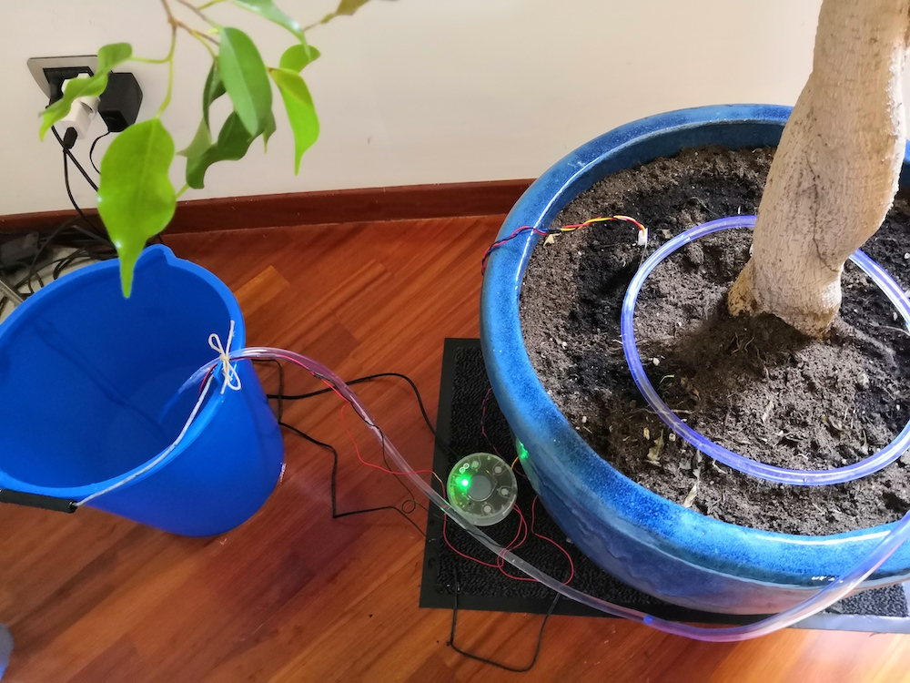

# Watering Mario 🌳

Mario is a tree, despite its name. For the curious, Mario is a 3 meter tall ficus benjamina siting in my living room. Mario needs about 2 litres of water every two days.

I'm using an [Arduino Oplà IoT Kit](http://store.arduino.cc/opla-iot-kit) to water it. Oplà is a cute round device with a color display, touch buttons, relays, sensors and more. It comes with a nice set of [pre-built applications](https://opla.arduino.cc/opla/module/iot-starter-kit-maker/lesson/06-smart-garden) that can be deployed with a click, but I had more custom needs so I wrote my own code.

## Hardware

In addition to Oplà IoT Kit, I got:

* this [pump](https://www.amazon.it/gp/product/B07KJK6S4H/ref=ppx_yo_dt_b_asin_title_o03_s00?ie=UTF8&psc=1)
* this [power supply](https://www.amazon.it/gp/product/B019IHQND8/ref=ppx_yo_dt_b_asin_title_o03_s01?ie=UTF8&psc=1)
* a little USB power supply to power Oplà

## Software

This watering system is based on [Arduino Cloud](https://store.arduino.cc/digital/create), which provides a very easy way to build a web/mobile dashboard which also serves as remote control to trigger watering from my smartphone when I'm not home.
